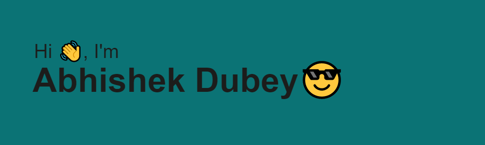

## I'm a Student, Video Editor, Developer, and Engineer!!

- 🌱 I’m currently upgrading my skill portfolio
- 👯 I’m looking to collaborate with other content creators
- 🥅 2023 Goals: Expertise in web development
- ⚡ Fun fact: I am a video editor also

 

            
### Connect with me:

### Languages and Tools:

 
 

Watch this snake eat up my contribution graph
<picture>
  <source media="(prefers-color-scheme: dark)" srcset="https://raw.githubusercontent.com/AbhiD1678/AbhiD1678/output/github-contribution-grid-snake-dark.svg">
  <source media="(prefers-color-scheme: light)" srcset="https://raw.githubusercontent.com/AbhiD1678/AbhiD1678/output/github-contribution-grid-snake.svg">
  
</picture>
